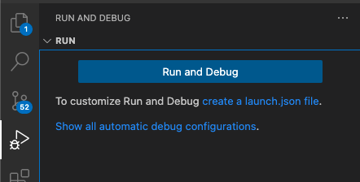
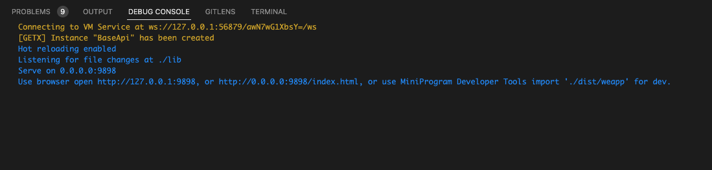
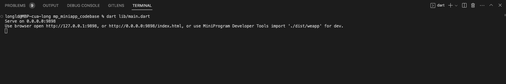
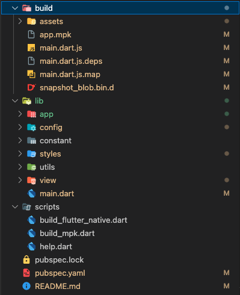

# MPFlutter mini-app architecture

A mini app architecture for MPFlutter.

## Project Structure
```
|-- lib
    |-- main.dart
    |-- app
        |-- data
            |-- data_source
                |-- local
                    |-- token_local_data_source.dart
                |-- remote
                    |-- api
                        |-- api_service.dart
                    |-- base
                        |-- base_client.dart
                        |-- network_intercepstors.dart
            |-- models
                |-- base_reponse.dart
                |-- refresh_token_response.dart
                |-- rx_data_status.dart
            |-- repository
                |-- repo.dart
                |-- repo_impl.dart
            |-- services.dart
        |-- pages
            |-- home
            |-- page
                |-- controller
                |-- entity
                |-- screen
    |-- config
        |-- api_config.dart
    |-- constant
    |-- styles
        |-- colors.dart
        |-- styles.dart
    |-- utils
        |-- debounce.dart
        |-- jwt_decoder.dart
        |-- utils.dart
    |-- view
    |-- scripts
```

## Run project
#### Debug
Solution 1: Chose Run and Debug in VSCode




Solution 2: Use terminal
```console
dart lib/main.dart
```


#### Build mpk
```console
dart scripts/build_mpk.dart
```
Output

